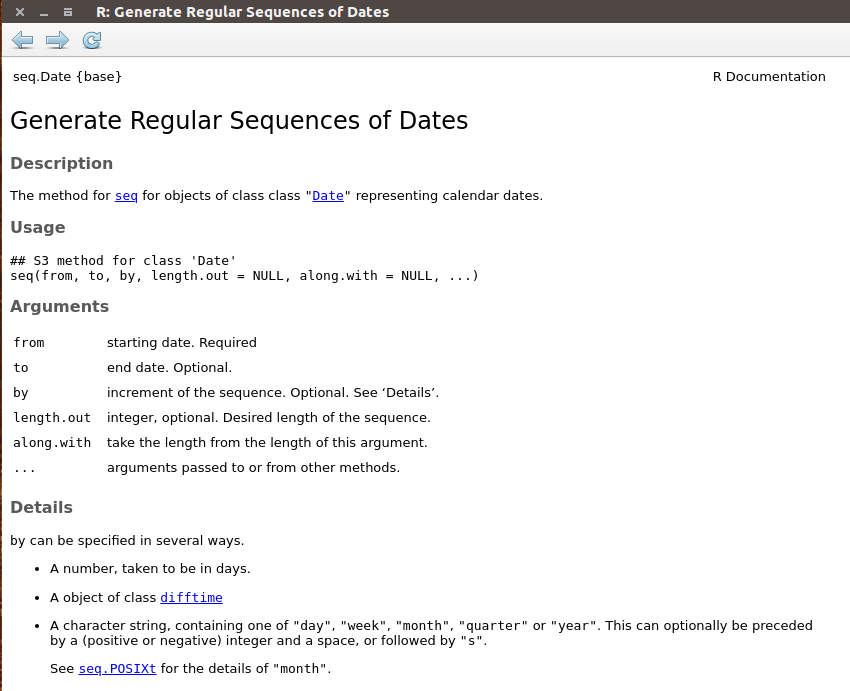
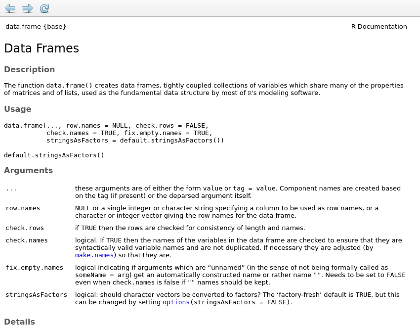

R Programming: Functions, for loops, and tidyverse
========================================================
autosize: true
transition: none
css: custom.css

Learning Objectives
==============
* functions: what to do?
* control structures: 
  - for loop: how many times to repeat?
* tidyverse: a collection of packages to ease data science tasks
    
Learning Objectives
==============
* **functions**: what to do?
* control structures: 
  - for loop: how many times to repeat?
* tidyverse: a collection of packages to ease data science tasks
  
Functions: what to do
==============
* Every data step is accomplished with functions
* You can use built-in functions or define your own
* Functions are a set of steps that are named and saved to use later

Functions: what to do
==============
* How to define a function, psuedo-code:

myfunction <- function(arg1, arg2 = default2) **{**

    take arguments as inputs
    do some data steps involving the arguments
    return(an object)
  
**}**

Functions: what to do
==============
* an example function


```r
half.it<- function(x) {
  y<-x/2
  return(y)
}

myvector<-1:10
myvector
```

```
 [1]  1  2  3  4  5  6  7  8  9 10
```

```r
new.vect<-half.it(myvector)
new.vect
```

```
 [1] 0.5 1.0 1.5 2.0 2.5 3.0 3.5 4.0 4.5 5.0
```

Functions: Explore some known functions
==============
* type ?**function** at the command line to get its help page
* ex: ?seq.Date
* type **function** at the command line to print the function code


Functions: Explore some known functions
==============
* ex: seq.Date()

```r
?seq.Date
```



Functions: Explore some known functions
==============
* ex: seq.Date(), see the source code

```r
seq.Date
```

```
function (from, to, by, length.out = NULL, along.with = NULL, 
    ...) 
{
    if (missing(from)) 
        stop("'from' must be specified")
    if (!inherits(from, "Date")) 
        stop("'from' must be a \"Date\" object")
    if (length(as.Date(from)) != 1L) 
        stop("'from' must be of length 1")
    if (!missing(to)) {
        if (!inherits(to, "Date")) 
            stop("'to' must be a \"Date\" object")
        if (length(as.Date(to)) != 1L) 
            stop("'to' must be of length 1")
    }
    if (!missing(along.with)) {
        length.out <- length(along.with)
    }
    else if (!is.null(length.out)) {
        if (length(length.out) != 1L) 
            stop("'length.out' must be of length 1")
        length.out <- ceiling(length.out)
    }
    status <- c(!missing(to), !missing(by), !is.null(length.out))
    if (sum(status) != 2L) 
        stop("exactly two of 'to', 'by' and 'length.out' / 'along.with' must be specified")
    if (missing(by)) {
        from <- unclass(as.Date(from))
        to <- unclass(as.Date(to))
        res <- seq.int(from, to, length.out = length.out)
        return(.Date(res))
    }
    if (length(by) != 1L) 
        stop("'by' must be of length 1")
    valid <- 0L
    if (inherits(by, "difftime")) {
        by <- switch(attr(by, "units"), secs = 1/86400, mins = 1/1440, 
            hours = 1/24, days = 1, weeks = 7) * unclass(by)
    }
    else if (is.character(by)) {
        by2 <- strsplit(by, " ", fixed = TRUE)[[1L]]
        if (length(by2) > 2L || length(by2) < 1L) 
            stop("invalid 'by' string")
        valid <- pmatch(by2[length(by2)], c("days", "weeks", 
            "months", "quarters", "years"))
        if (is.na(valid)) 
            stop("invalid string for 'by'")
        if (valid <= 2L) {
            by <- c(1, 7)[valid]
            if (length(by2) == 2L) 
                by <- by * as.integer(by2[1L])
        }
        else by <- if (length(by2) == 2L) 
            as.integer(by2[1L])
        else 1
    }
    else if (!is.numeric(by)) 
        stop("invalid mode for 'by'")
    if (is.na(by)) 
        stop("'by' is NA")
    if (valid <= 2L) {
        from <- unclass(as.Date(from))
        if (!is.null(length.out)) 
            res <- seq.int(from, by = by, length.out = length.out)
        else {
            to0 <- unclass(as.Date(to))
            res <- seq.int(0, to0 - from, by) + from
        }
        res <- .Date(res)
    }
    else {
        r1 <- as.POSIXlt(from)
        if (valid == 5L) {
            if (missing(to)) {
                yr <- seq.int(r1$year, by = by, length.out = length.out)
            }
            else {
                to0 <- as.POSIXlt(to)
                yr <- seq.int(r1$year, to0$year, by)
            }
            r1$year <- yr
            res <- as.Date(r1)
        }
        else {
            if (valid == 4L) 
                by <- by * 3
            if (missing(to)) {
                mon <- seq.int(r1$mon, by = by, length.out = length.out)
            }
            else {
                to0 <- as.POSIXlt(to)
                mon <- seq.int(r1$mon, 12 * (to0$year - r1$year) + 
                  to0$mon, by)
            }
            r1$mon <- mon
            res <- as.Date(r1)
        }
    }
    if (!missing(to)) {
        to <- as.Date(to)
        res <- if (by > 0) 
            res[res <= to]
        else res[res >= to]
    }
    res
}
<bytecode: 0x39ce748>
<environment: namespace:base>
```

Functions: Arguments
==============
* if you call the arguments in the default order, there's no need to specify the argument name
* if you call them out of order, you need to specify the argument name
* you can use the beginning of the argument name

Functions: Arguments
==============
* valid ways to write function arguments

```r
##specify all argument names
seq.Date(from=as.Date("2019-01-01"),to=as.Date("2019-01-10"), by=2)
```

```
[1] "2019-01-01" "2019-01-03" "2019-01-05" "2019-01-07" "2019-01-09"
```

```r
##leave argument names out, but put argments in the right order
seq.Date(as.Date("2019-01-01"),as.Date("2019-01-10"), 2)
```

```
[1] "2019-01-01" "2019-01-03" "2019-01-05" "2019-01-07" "2019-01-09"
```

```r
##specify argments in a differnt order, use just the beginining of the arg. name
seq.Date(t=as.Date("2019-01-10"),f=as.Date("2019-01-01"), b=2)
```

```
[1] "2019-01-01" "2019-01-03" "2019-01-05" "2019-01-07" "2019-01-09"
```

Functions: Arguments
==============
* arguments without defaults are required
* note that the error messages are useful
* try searching the internet with the extact text of an error message


```r
seq.Date(from=as.Date("2019-01-01"),to=as.Date("2019-01-10"))
```

```
Error in seq.Date(from = as.Date("2019-01-01"), to = as.Date("2019-01-10")): exactly two of 'to', 'by' and 'length.out' / 'along.with' must be specified
```

  Functions: Arguments
  ==============
  * arguments with defaults will be set for you if you don't change them
  
  ```r
  ?data.frame
  ```
  
  
  
  Functions: Arguments
  ==============
  * arguments with defaults will be set for you if you don't change them
  * data.frame will default to setting characters as factors
  
  ```r
  dat<-data.frame(id=c("a","b", "c"), x=1:3)
  str(dat)
  ```
  
  ```
  'data.frame':	3 obs. of  2 variables:
   $ id: Factor w/ 3 levels "a","b","c": 1 2 3
   $ x : int  1 2 3
  ```
  
  ```r
  dat
  ```
  
  ```
    id x
  1  a 1
  2  b 2
  3  c 3
  ```
  
  ```r
  unclass(dat$id)
  ```
  
  ```
  [1] 1 2 3
  attr(,"levels")
  [1] "a" "b" "c"
  ```
  
  Factors: A quick warning
  ==============
  * factors are useful in some situations, but are often interpreted by functions as the underying integers
  
  
  ```r
  dat$id<-ifelse(dat$id=="a","z",dat$id)
  dat
  ```
  
  ```
    id x
  1  z 1
  2  2 2
  3  3 3
  ```
  
  ```r
  dat<-data.frame(id=letters[1:3], x=1:3)
  dat$id<-ifelse(dat$id=="a","z",as.character(dat$id))
  dat
  ```
  
  ```
    id x
  1  z 1
  2  b 2
  3  c 3
  ```
  
  Functions: Arguments
  ==============
  * arguments with defaults will be set for you if you don't change them
  * can change the encoding of the data frame by setting the stringsAsFactors argument yourself
  
  ```r
  dat2<-data.frame(id=c("a","b", "c"), x=1:3, stringsAsFactors=F)
  str(dat2)
  ```
  
  ```
  'data.frame':	3 obs. of  2 variables:
   $ id: chr  "a" "b" "c"
   $ x : int  1 2 3
  ```
  
  ```r
  dat2$id<-ifelse(dat2$id=="a","z",dat2$id)
  dat2
  ```
  
  ```
    id x
  1  z 1
  2  b 2
  3  c 3
  ```
  
  Functions: Explore the function we made
  ==============
  * half.it
  
  ```r
  half.it
  ```
  
  ```
  function(x) {
    y<-x/2
    return(y)
  }
  ```

Functions: what to do
==============
* Can make your own functions as complicated as you like


```r
calc_index_l8<-function(dat.frame){
  ##This function assumes it is supplied with a data frame
  ##This function needs a data frame with Landsat 8 bands as columns
  ##The data frame should have the column names b1 for band1, etc.
  ##The function will return NDVI, a Simple Ratio, and SAVI
  
  ndvi<-(dat.frame$b5-dat.frame$b4)/(dat.frame$b5+dat.frame$b4) 
  indices<-data.frame(ndvi=ndvi)
  indices$sr<-(dat.frame$b5/dat.frame$b4)
  indices$savi <- 1.5*(dat.frame$b5-dat.frame$b4) /
                  (dat.frame$b5+dat.frame$b4+0.5)
  return(indices)
}
```

Functions: R practice on your own
==============
* With the last example as a code recipe, define a function that calculates vegetation indices from the super GER
  - Use the bands for the veg indices you identified in lab 1
* How can you add these indices as columns in your data? (see the combining data slides or cheatsheet)
* try this later as practice on your own


Learning Objectives
==============
* functions: what to do?
* control structures: 
  - **for loop**: how many times to repeat?
* tidyverse: a collection of packages to ease data science tasks
  
Control Stuctures: for
==============
* Tells the computer to repeat something 
* psuedo-code:

for( val in sequence ) **{**

    do some data steps on x[val]
    
**}**

* above, val will take on the sequence values, iteratively each time through the loop

Control Stuctures: for
==============

```r
x<-letters[1:3]
x
```

```
[1] "a" "b" "c"
```

```r
for(i in 1:length(x)){
  print(paste("this one was", x[i]))
}
```

```
[1] "this one was a"
[1] "this one was b"
[1] "this one was c"
```

Control Stuctures: for
==============
* can use for loops to collect a result

```r
## a loop to collect a new result
x<-1:10

##intialize a result vector
result<-0
for(i in 1:length(x)){
  result[i]<- x[i]*x[i]
  print(paste("i is", i, "and result[i] is", result[i]))
}
```

```
[1] "i is 1 and result[i] is 1"
[1] "i is 2 and result[i] is 4"
[1] "i is 3 and result[i] is 9"
[1] "i is 4 and result[i] is 16"
[1] "i is 5 and result[i] is 25"
[1] "i is 6 and result[i] is 36"
[1] "i is 7 and result[i] is 49"
[1] "i is 8 and result[i] is 64"
[1] "i is 9 and result[i] is 81"
[1] "i is 10 and result[i] is 100"
```

```r
result
```

```
 [1]   1   4   9  16  25  36  49  64  81 100
```

For loop: practice
==============
* see if you can plot the iris data with different colors by species via a for loop

```r
colors<-c("red", "blue", "green")
x<-unique(iris$Species)
plot(iris$Sepal.Length[iris$Species=="setosa"], 
     iris$Sepal.Width[iris$Species=="setosa"], 
     xlab= "Sepal Length (mm)", ylab= "Sepal Width (mm)", 
     pch=19, col=colors[1])
```
for( i in ??){

    points(    some code here that plots points for other the species  )
}

* hint: replace ?? with a sequence, 
* hint: for the points code, start with the code for adding points for one species 
* you can also use the x vector we created in the first code chunk to index the species; to see this, try x[1]


Learning Objectives
==============
* functions: what to do?
* control structures: 
    - for loop: how many times to repeat?
* **tidyverse**: a collection of packages to ease data science tasks

tidyverse: a new way to code data science tasks
==============
* developed mostly by Hadley Wickham, who also developed RStudio
* a naturally interacting set of packages with "a common data philosophy"
* many of the libraries load together with **library(tidyverse)**
  - dplyr, ggplot, stringr, etc
* they can also be loaded individually
* well described in "R for Data Science" at https://r4ds.had.co.nz
* see also the many cheatsheets available under help in RStudio, or online at: https://rstudio.com/resources/cheatsheets/

tidyverse: a new way to code data science tasks
==============
* tidyverse functions recreate functionality that already exists in base R, but are sometimes more intuitive
* tidyverse functions can be either faster or slower for your computer to run than base R
* when to use tidyverse vs base R varies by taste and the data task
* these exercises use base R for plotting, **stringr** for string manipulation, and both base R and **dplyr**/**plyr** as needed for data manipulation

tidyverse: dplyr for data manipulation
==============
* see the data transformation/dplyr cheat sheet
* has functions that are "verbs" for data manipulation:
    - filter() ; arrange (), select(), mutate(), summarise(); group_by()
* the first function argument is the data frame, the next is the column name w/o any **" "** or **$**

```r
library(dplyr)
filter(iris, Species=="setosa")
```

```
   Sepal.Length Sepal.Width Petal.Length Petal.Width Species
1           5.1         3.5          1.4         0.2  setosa
2           4.9         3.0          1.4         0.2  setosa
3           4.7         3.2          1.3         0.2  setosa
4           4.6         3.1          1.5         0.2  setosa
5           5.0         3.6          1.4         0.2  setosa
6           5.4         3.9          1.7         0.4  setosa
7           4.6         3.4          1.4         0.3  setosa
8           5.0         3.4          1.5         0.2  setosa
9           4.4         2.9          1.4         0.2  setosa
10          4.9         3.1          1.5         0.1  setosa
11          5.4         3.7          1.5         0.2  setosa
12          4.8         3.4          1.6         0.2  setosa
13          4.8         3.0          1.4         0.1  setosa
14          4.3         3.0          1.1         0.1  setosa
15          5.8         4.0          1.2         0.2  setosa
16          5.7         4.4          1.5         0.4  setosa
17          5.4         3.9          1.3         0.4  setosa
18          5.1         3.5          1.4         0.3  setosa
19          5.7         3.8          1.7         0.3  setosa
20          5.1         3.8          1.5         0.3  setosa
21          5.4         3.4          1.7         0.2  setosa
22          5.1         3.7          1.5         0.4  setosa
23          4.6         3.6          1.0         0.2  setosa
24          5.1         3.3          1.7         0.5  setosa
25          4.8         3.4          1.9         0.2  setosa
26          5.0         3.0          1.6         0.2  setosa
27          5.0         3.4          1.6         0.4  setosa
28          5.2         3.5          1.5         0.2  setosa
29          5.2         3.4          1.4         0.2  setosa
30          4.7         3.2          1.6         0.2  setosa
31          4.8         3.1          1.6         0.2  setosa
32          5.4         3.4          1.5         0.4  setosa
33          5.2         4.1          1.5         0.1  setosa
34          5.5         4.2          1.4         0.2  setosa
35          4.9         3.1          1.5         0.2  setosa
36          5.0         3.2          1.2         0.2  setosa
37          5.5         3.5          1.3         0.2  setosa
38          4.9         3.6          1.4         0.1  setosa
39          4.4         3.0          1.3         0.2  setosa
40          5.1         3.4          1.5         0.2  setosa
41          5.0         3.5          1.3         0.3  setosa
42          4.5         2.3          1.3         0.3  setosa
43          4.4         3.2          1.3         0.2  setosa
44          5.0         3.5          1.6         0.6  setosa
45          5.1         3.8          1.9         0.4  setosa
46          4.8         3.0          1.4         0.3  setosa
47          5.1         3.8          1.6         0.2  setosa
48          4.6         3.2          1.4         0.2  setosa
49          5.3         3.7          1.5         0.2  setosa
50          5.0         3.3          1.4         0.2  setosa
```


tidyverse: dplyr for data manipulation
==============
* several function-verbs can be joined together with the pipe symbol  %>% 
* Note the new data structure, tibble; this is the tidyverse version of a data frame


```r
names(iris)
```

```
[1] "Sepal.Length" "Sepal.Width"  "Petal.Length" "Petal.Width" 
[5] "Species"     
```

```r
iris %>% filter(Sepal.Width<3.3) %>% group_by(Species) %>% summarise(Sep.Len=mean(Sepal.Length))
```

```
# A tibble: 3 x 2
  Species    Sep.Len
  <fct>        <dbl>
1 setosa        4.69
2 versicolor    5.93
3 virginica     6.53
```

tidyverse: practice
==============
* see if you can add another column summarising other variables inside summarise()
* To use the code below to get started, just remove the comment symbols **#**
* can you summarise with other functions besides mean()? 
  - Try sd(), sum(), +, /
* what if you change the filter step?

```r
iris %>% filter(Sepal.Width<3.3) %>% group_by(Species) %>% 
  summarise(Sep.Len=mean(Sepal.Length) #,
#           var.name= 
             )
```

Lets try some exercises
==============
type: section

there's a lot more to learn, but we have enough to get started

Prefered topics for next lecture
==============
* Image manipulation: Get vegetation fraction from jpegs of plants
* When Vegetation Indices aren't enough:
  -  Partial Least Squares Regression (how to use all the bands in your regression model)
  -  One Machine Learning Model (use all the bands in black box algorithm)
     + Random Forests
     + Extreme Gradient Boosting
* Something else?
* Email me if you have a favorite. We can likely only cover two topics.
